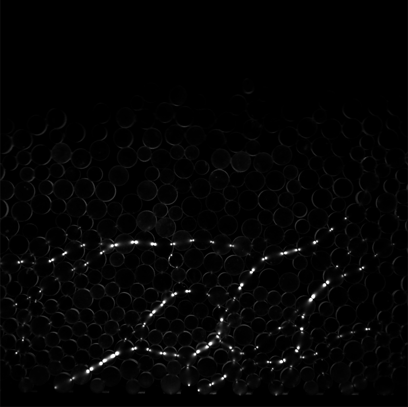

# Photoelastic-Centroid-Aware-YOLOv8L
YOLOv8-L based centroid detection in photoelastic granular flows on inclined surfaces.

This project implements a centroid detection system for photoelastic granular flows on inclined surfaces using the YOLOv8-L model with transfer learning. The goal is to accurately detect and track particle centroids and radii from experimental images to support further granular flow analysis.


## Features

- Transfer learning using YOLOv8-L for object detection on custom photoelastic datasets  
- Precise centroid and radius estimation from bounding boxes  
- Data preprocessing and augmentation pipelines  
- Inference scripts to visualize and export detection results  
- Evaluation metrics including precision, recall, and F1-score


# YOLO Data Preprocessing Script
## 1. Image Preprocessing
To improve the model's ability to perceive key features in images during training, this study performed a series of image preprocessing operations on the raw photoelastic images.

Mainly these operations include:

- Gaussian blurring: This reduces high-frequency noise and smoothes background and non-target areas.

- Contrast enhancement: This enhances photoelastic streaks and particle edges, making force chain features more distinct.

This helps the model more easily focus on key areas such as particle structure and stress distribution during training, thereby improving prediction accuracy.
### Image-Preprocess Visualization
<table>
  <tr>
    <td>
      <br>
      <p align="center"><b>Raw image</b><br><code>basename.tif</code></p>
    </td>
    <td>
      <br>
      <p align="center"><b>GaussianBlur</b><br><code>basename_(1).tif</code></p>
    </td>
    <td>
      <br>
      <p align="center"><b>Contrast</b><br><code>basename_(2).tif</code></p>
    </td>
  </tr>
</table>

## 2. Label Annotation
To avoid manual annotation, we used image processing algorithms written in MATLAB to automatically extract the centroids and radii of photoelastic particles. These results are converted into YOLOv8-compatible labels. The following outlines the script structure and folder organization:
```
    Automated Labeling Scripts via Image Processing
    │
    ├── Rawimg.tif
    |   ├── Centroid.m            % Main function: image processing and particle extraction
    |   ├── frameName.m           % Auxiliary function: generate file name
    |   ├── dig2str.m             % Auxiliary function: number formatting
    |   ├── PTV2.m                % Main process script: modify processing parameters and range 
    |   │
    |   ├── results/   
    |   │   ├── label.tif   
    |   │   └── label.mat
```
### Label Visualization
<table>
  <tr>
    <td>
      <br>
      <p align="center"><b>Raw image</b><br><code>Rawimg.tif</code></p>
    </td>
    <td>
      <br>
      <p align="center"><b>Label image</b><br><code>label.tif</code></p>
    </td>
    <td>
      <table>
        <tr><th>x (px)</th><th>y (px)</th><th>r (px)</th></tr>
        <tr><td>17.7100</td><td>255.3656</td><td>18</td></tr>
        <tr><td>24.1099</td><td>330.5085</td><td>24</td></tr>
        <tr><td>12.1825</td><td>399.0238</td><td>18</td></tr>
        <tr><td>12.1902</td><td>531.2927</td><td>18</td></tr>
        <tr><td>15.4267</td><td>612.7933</td><td>18</td></tr>
        <tr><td>17.5299</td><td>672.2507</td><td>18</td></tr>
        <tr><td>15.4957</td><td>759.8788</td><td>18</td></tr>
        <tr><td>18.7855</td><td>842.1072</td><td>18</td></tr>
      </table>
      <p align="center"><b>Photoelastic Centroids</b><br><code>label.mat</code></p>
    </td>
  </tr>
</table>

## 3. Label Transformation

```label preprocessing.py``` is the script that converts circle annotation data stored in ```.mat``` files into YOLO-compatible label files. The script normalizes the coordinates and dimensions of annotated circles to match YOLO's labeling format.
- Extracts circle coordinates and dimensions (```x```, ```y```, ```r```) in ```.mat``` files.
- Extracts Raw image dimensions (```W```, ```H```).
- Generates YOLO label as ```.txt``` files with the format:
```
<Class_id> <Normalized_x> <Normalized_y> <Normalized_w> <Normalized_h>
```
     <Class_id> : 0 (single class for circles)
     ( <Normalized_x> , <Normalized_y> ) : ( x / W , y / H ), Normalized circle center coordinates.
     ( <Normalized_w> , <Normalized_h> ) : ( 2r / W , 2r / H ), Normalized circle dimensions.

- Add two additional labels with the same content and distinguished by ```basename_(1).txt``` and ```basename_(2).txt``` to correspond to the Gaussian blurred and contrast enhanced images.

## 4. Dataset Organization
### Original Dataset
```
dataset/
├── baseline/
│   ├── basename.tif/
│   │   ├── train/
│   │   ├── test/
│   ├── basename.txt/
│   │   ├── train/
│   │   ├── test/
├── blur/
│   ├── basename_(1).tif/
│   │   ├── train/
│   │   ├── test/
│   ├── basename_(1).txt/
│   │   ├── train/
│   │   ├── test/
├── contrast/
│   ├── basename_(2).tif/
│   │   ├── train/
│   │   ├── test/
│   ├── basename_(2).txt/
│   │   ├── train/
│   │   ├── test/
```
### Step1. Transform the Dataset Structure
To centrally manage training and testing data for different image processing strategies (such as blurring and contrast adjustment), we have reorganized the folder structure, which was originally categorized by processing type (e.g., ```baseline/```, ```blur/```, ```contrast/```), into a structure centered around training purposes (```train/```, ```test/```).
```
dataset/
├── train/
│   ├─ images/
│   │   ├── basename.tif 
│   │   ├── basename_(1).tif 
│   │   ├── basename_(2).tif
│   ├─ labels/
│   │   ├── basename.txt
│   │   ├── basename_(1).txt
│   │   ├── basename_(2).txt 
├── test/ 
│   ├─ images/
│   │   ├── basename.tif 
│   │   ├── basename_(1).tif 
│   │   ├── basename_(2).tif
│   ├─ labels/
│   │   ├── basename.txt
│   │   ├── basename_(1).txt
│   │   ├── basename_(2).txt 
```
### Step2. Create ```data.yaml```
Define the dataset configuration in data.yaml. This file tells YOLO where to find the training and validation data, the number of classes, and their names. Here’s an example data.yaml file for this project:
```yaml
train: dataset/train       # Path to training images and labels
val: dataset/test          # Path to testing images and labels

nc: 1                # Number of classes (only circles)
names: [circle]      # Class name
```
## YOLOv8l Training

- Training Script with Hyperparameter Tuning
  
```python
from ultralytics import YOLO
if __name__ == '__main__':
# Load YOLOv8l model (large version)
model = YOLO('yolov8l.pt')  

# Train the model
model.train(
data='C:/Users/lab533/Desktop/Best_now0321/data.yaml',
  epochs=80,        # Increase training epochs for better convergence
  imgsz=1280,       # Increase image resolution for better center point accuracy
  batch=4,          # Reduce batch size to accommodate larger model
  lr0=0.0003,       # Lower initial learning rate to prevent overfitting
  lrf=0.1,          # Reduce final learning rate for smoother convergence
  freeze=0,         # Freeze the first 5 layers to stabilize training
  
  # **Reduce the impact of data augmentation**
  flipud=0.5,       # Reduce vertical flipping
  mosaic=0.3,       # Lower mosaic probability to avoid excessive distortion
  mixup=False,      # Disable mixup to prevent circle deformation
  scale=0.8,        # Limit scaling factor to avoid shifting the center point
  
  # **Color augmentation**
  hsv_h=0.015,      
  hsv_s=0.3,        
  hsv_v=0.9,        
  
  # **Adjust IoU and loss weights**
  iou=0.8,          # Lower IoU threshold to allow more detections
  box=4.0,          # Reduce box weight for balanced bounding box regression
  cls=1.0,          # Keep classification weight unchanged
  dfl=1.5,          # Increase distribution focal loss weight for better accuracy
  
  # **Mixed precision training**
  half=True,        # Enable mixed precision for faster training
  plots=True        # Enable loss curve visualization
)

    # Validate the model
    metrics = model.val()
```
- Inference
  ```yolo task=detect mode=predict model=runs/train/weights/best.pt source=dataset/images/val save=True
  Run prediction and save output images.

## Project Structure

  ```
  photoelastic-centroid-yolov8/
  │
  ├── dataset/                # Training and validation images and labels
  ├── runs/                   # YOLOv8 training output models and results
  ├── scripts/                # Custom training and prediction scripts
  ├── results/                # Prediction and evaluation results
  ├── README.md
  ├── requirements.txt        # Python package dependencies
  └── your_data.yaml          # YOLO format dataset config file
```

## Evaluation
- Evaluate detection performance using Precision, Recall, and F1-score.
- Custom scripts compare predicted centroids with ground truth, calculate errors, and visualize differences.

## References
- YOLOv8 official repository: https://github.com/ultralytics/ultralytics
- Relevant literature on photoelastic granular flow analysis

## Contact
CHEN BO WEI
Email: william20020602@gmail.com
GitHub: https://github.com/WilliamChennn
